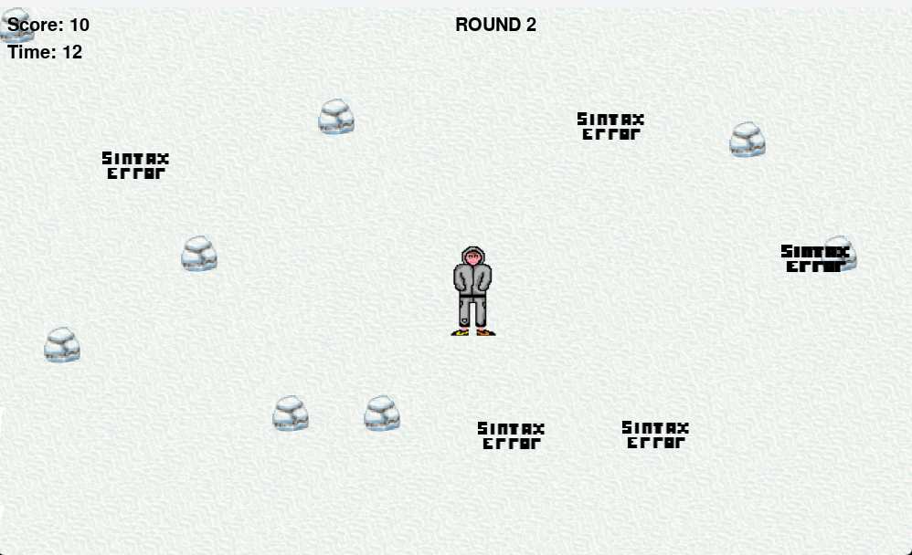

## CODE DEFENDER 💻

### Sos un programador que esta siendo atacado por errores, la unica forma de evitar que tu codigo se contagie es:
### - Corriendo 🏃[WASD]
### - Utilizando tus breakpoints 🔴 [CLICK]

---

### PREVIEW 🔍

---
- Todos los sprites fueron hechos por mí 👦
- Para los sonidos me inspire en los juegos arcade 🔉
- La funcionalidad que mas trabajo me costó fue implementar la pausa 🔧
- El juego se encuentra en el archivo llamado CodeDefender.py 

---
Recorda tener instalado la biblioteca de pygame
"""
pip install pygame
"""

**Espero se les guste** 🎮

